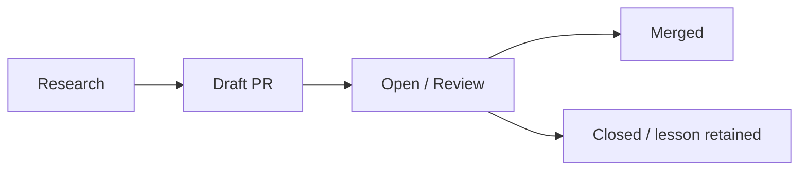

# CoreFoundry Contribution Ledger

A live public record of upstream open-source work tracked by CoreFoundry.

  **Merged:** 9 | **Open:** 19 | **Closed:** 4

> **Last synchronized:** 2026-10-09 09:30 UTC

## Canonical-source policy

CoreFoundry treats the **upstream pull request as the canonical public record**.

- upstream PR links are always primary;
- merged entries also retain the upstream merge-commit link when GitHub exposes one;
- contributor forks, local branches, staging repositories, and research harnesses are never required to reconstruct the public record;
- narrative metadata is curated, while PR state is synchronized automatically from GitHub.

## 🚀 Merged upstream work

| Project / PR | What it is | What changed | Evidence / impact | Why this matters |
|---|---|---|---:|---|
| **[urllib3/urllib3 #5304](https://github.com/urllib3/urllib3/pull/5304)** [merge commit `5ebe9bf`](https://github.com/urllib3/urllib3/commit/5ebe9bf9f691646dcabdb259ffabfc6108ded5e8) | Core HTTP and content-decoding infrastructure used throughout Python | Avoided an unnecessary bytes → bytearray → bytes copy for single-output gzip decompression | 8 paired A/B rounds across 15 controlled HTTP scenarios: ~19–23% lower client CPU time for tested 32 MiB gzip responses; decoder-only tests: ~26–27 μs saved/MiB | Eliminating a redundant output copy cuts decompression and HTTP client CPU costs without changing public APIs; workload-specific results, not production-average savings |
| **[pypa/packaging #1429](https://github.com/pypa/packaging/pull/1429)** [merge commit `d17cfaf`](https://github.com/pypa/packaging/commit/d17cfaf0b77a5690f03087359e7c8d665a3c728d) | Foundational Python packaging and requirement-parsing infrastructure | Avoided ast.literal_eval for plain quoted marker strings | ~13% faster on the representative Requirement corpus | Common marker values should not pay for a general-purpose literal parser |
| **[bloomberg/memray #1035](https://github.com/bloomberg/memray/pull/1035)** [merge commit `d0c34e8`](https://github.com/bloomberg/memray/commit/d0c34e8d6c341bf5e415220203e0a2563c9d65ff) | Python memory profiling and allocation-analysis infrastructure | Reduced high-contention Tracker synchronization overhead on Linux/glibc | Up to 28% runtime reduction at 256 threads | Profiling infrastructure should observe workloads without becoming a major bottleneck |
| **[Blosc/c-blosc2 #805](https://github.com/Blosc/c-blosc2/pull/805)** [merge commit `89dffce`](https://github.com/Blosc/c-blosc2/commit/89dffce3066e5b40e41ca506efb61596f863bc9a) | High-performance compression infrastructure | Avoided unnecessary parallel startup and worker wakeups for small jobs | 35.86 μs → 2.02 μs on a targeted 64-byte workload | Small workloads should not pay parallel execution costs they cannot amortize |
| **[urllib3/urllib3 #5287](https://github.com/urllib3/urllib3/pull/5287)** [merge commit `796d200`](https://github.com/urllib3/urllib3/commit/796d200d3070ead69ec3a5d848fecf52a2249b59) | Core HTTP infrastructure used throughout Python | Optimized the common single-value header path | ~9–13% faster in representative request-construction workloads | Foundational HTTP improvements can propagate across a large number of Python applications |
| **[Blosc/python-blosc2 #728](https://github.com/Blosc/python-blosc2/pull/728)** [merge commit `3ce2a39`](https://github.com/Blosc/python-blosc2/commit/3ce2a390a244ab2c6563d25da7f5b15e6583d24b) | Python interface to high-performance compressed-data infrastructure | Removed redundant full-block zeroing in a NumPy miniexpr gather path | ~2–15% improvement in tested workloads | Avoiding unnecessary memory work improves throughput without adding compute |
| **[numpy/numpy #32802](https://github.com/numpy/numpy/pull/32802)** [merge commit `24f3c80`](https://github.com/numpy/numpy/commit/24f3c807bd4397315028fce096ff939e577c13ed) | Foundational numerical-computing library | Fixed undefined shift behavior in the rational test dtype | Correctness fix | Low-level correctness bugs can affect a very large downstream dependency graph |
| **[Blosc/python-blosc2 #713](https://github.com/Blosc/python-blosc2/pull/713)** [merge commit `bf8ae3c`](https://github.com/Blosc/python-blosc2/commit/bf8ae3c57f06700b8e664df3534bf0990ab5f7ee) | Compressed-array and data infrastructure | Fixed two NDArray thread-safety bugs blocking free-threaded Python support | Concurrency correctness / free-threading readiness | Infrastructure must remain correct as Python moves toward broader free-threaded execution |
| **[scipy/scipy #26225](https://github.com/scipy/scipy/pull/26225)** [merge commit `35cf9df`](https://github.com/scipy/scipy/commit/35cf9df1a24bd2e97598edaf56e0545b992508ba) | Scientific-computing algorithms and numerical methods | Initialized bracketing-solver iteration counts on early-return paths | Correct zero-iteration solver statistics | Reliable solver accounting improves correctness and observability |

## 🟢 Open / in review

| Project / PR | What it is | What changed | Evidence / impact | Why this matters |
|---|---|---|---:|---|
| **[opencv/opencv #30177](https://github.com/opencv/opencv/pull/30177)** | A pull request proposing opt-in zero-copy BGRA retrieval for OpenCV’s macOS AVFoundation video capture path. | The BGRA path wraps the existing CVPixelBuffer pixels in a cv::Mat and retains the pixel buffer for frame lifetime. Existing BGR/RGB/GRAY/YUYV paths remain unchanged; UMat still copies. After review identified that BGRA retrieval consumed the grabbed frame and broke repeated retrieve() calls, the author updated the implementation to preserve the frame until the next grab and added a regression test. | — ([source](https://github.com/opencv/opencv/pull/30177)) | Callers that can accept BGRA may avoid the color conversion and extra frame work inside retrieve(). The PR also notes a memory trade-off: retaining pixel buffers while callers keep frames alive can increase memory use. |
| **[bloomberg/bde #319](https://github.com/bloomberg/bde/pull/319)** | A proposed optimization for BDE LoggerManager default-logger lookups: it caches a thread-local negative result ('this thread has no custom logger') so repeated lookups can skip lock-and-map work while preserving the existing fallback path. | The PR adds a fast path for the case where a thread repeatedly resolves the global default logger and has never set a custom logger. It remembers only the negative condition for the current thread, invalidates it when the thread changes logger or when a manager is recreated, and leaves the public class layout and existing behavior outside that path unchanged. | The PR body says: 'remember a negative lookup for the current thread, reuse it while valid' and 'The cache remembers only that this thread has no custom logger. It never caches a custom Logger*.' It also reports that in the instrumented mixed workload, '55.6% of calls ... used the new fast path' and that paired CPU time was '53–56% lower' on three Ubuntu runners; it explicitly notes these are component-level results and not end-to-end logging performance. ([source](https://github.com/bloomberg/bde/pull/319)) | It targets repeated low-level logger lookup overhead in mixed custom/default workloads without redesigning logger ownership or changing the public API. The author presents it as a focused review proposal rather than a universal optimization, with trade-offs around cache invalidation and extra TLS/atomic state. |
| **[scientific-python/blog.scientific-python.org #277](https://github.com/scientific-python/blog.scientific-python.org/pull/277)** | A proposed Scientific Python blog article titled "BLOG: Finding Another Layer of Performance in np.searchsorted," describing a performance investigation around reusing insertion-position locality in NumPy search behavior. | The PR adds article content that focuses on reusing information from prior searches, deciding when locality is useful, the 8 / 16 / 32 observation experiments, hardware-dependent activation behavior, and how reducing search work complements earlier batched-search optimization. The body also says the NumPy implementation of the experiment is under separate review and that the article centers on the performance idea, experimental process, and broader optimization insight. | — ([source](https://github.com/scientific-python/blog.scientific-python.org/pull/277)) | It documents a performance-analysis idea in NumPy search optimization and signals that the blog should align with a separate upstream implementation review to reflect current changes. |
| **[numpy/numpy #32895](https://github.com/numpy/numpy/pull/32895)** | A proposed NumPy optimization for batched `searchsorted` that reuses prior insertion-position information when consecutive query keys have strong locality, with a selector and a conservative activation threshold to avoid paying the added logic cost on less favorable workloads. | The PR adds a locality-aware fast path to batched `searchsorted`, uses 16 sampled intermediate positions from the existing batched binary-search computation to detect helpful locality, and adds a `Q >= 2^20` gate so the optimization is only used when the author judged the benefit large enough to justify the extra overhead. The author later refined the selector to reject adversarial patterns by comparing each sampled point with the value immediately before it, and added tests covering large-query cases, duplicate keys, NaN/NaT/complex NaN, disordered inputs, and focused ASV checks. | — ([source](https://github.com/numpy/numpy/pull/32895)) | The work is relevant because it targets a real performance opportunity in NumPy's batched `searchsorted` path, but it also treats the problem as a hybrid algorithm with selector risk, machine-specific cost, and maintenance burden. The discussion shows the central tradeoff: a fast path can help strongly local workloads, but maintainers are concerned about degradation risk, the cost of complexity, and the need for broad benchmark and adversarial-case validation before accepting such a path. |
| **[bloomberg/memray #1040](https://github.com/bloomberg/memray/pull/1040)** | A Memray pull request that optimizes allocation-record serialization by encoding one logical record into a fixed 32-byte stack buffer and writing it once through Sink::writeAll(), while preserving the existing wire format and behavior. | The production change is limited to src/memray/_memray/record_writer.cpp, tests/integration/test_record_writer.py, and news/1039.feature.rst. It removes repeated sink-entry overhead for one logical allocation record, keeps the same wire format, and adds validation for 32-bit/64-bit encoding, semantic equivalence, contention, and failed-I/O byte-boundary cases. | — ([source](https://github.com/bloomberg/memray/pull/1040)) | It reduces repeated abstraction overhead in a hot allocation-record path without introducing heap allocation, new caches, synchronization, syscalls, or persistent state. The PR also documents the 32-byte bound and notes that future wire-format growth would require updating that bound and boundary tests together. |
| **[bloomberg/bde #317](https://github.com/bloomberg/bde/pull/317)** | Low-level C++ infrastructure and foundational libraries | Preserved an already-known path length instead of rescanning through c_str() | Targeted appendRaw/popLeaf latency reductions of ~14–73% | Already-known metadata should not be discarded and recomputed on hot paths |
| **[bloomberg/bde #315](https://github.com/bloomberg/bde/pull/315)** | Low-level C++ infrastructure and foundational libraries | Removed an unreachable stale AIX semaphore-policy branch | Maintenance / compatibility cleanup with current configurations validated | Removing unreachable platform logic reduces maintenance surface and future ambiguity |
| **[bloomberg/blazingmq #1806](https://github.com/bloomberg/blazingmq/pull/1806)** | Enterprise messaging infrastructure | Separated key-building storage from final canonical-string storage | Most targeted PR2-vs-PR1 comparisons improved in final staged validation | Allocator growth history can create hidden performance cliffs even after obvious temporary allocations are removed |
| **[bloomberg/blazingmq #1803](https://github.com/bloomberg/blazingmq/pull/1803)** | Enterprise messaging infrastructure | Removed temporary schema-key string construction | 120/120 controlled hot-path comparisons faster; median CPU ~61% lower in final validation | Temporary allocation on a repeated schema path can dominate otherwise small work |
| **[numpy/numpy #32787](https://github.com/numpy/numpy/pull/32787)** | Foundational numerical-computing and random-number infrastructure | Preserved BitGenerator state when reinitialization fails | Correctness / state-integrity fix | Failed initialization should not leave foundational random-number state partially mutated |
| **[dateutil/dateutil #1590](https://github.com/dateutil/dateutil/pull/1590)** | Date/time, recurrence, and timezone infrastructure | Used binary search for deep queries over already-ordered completed recurrence caches | ~4,500–5,700× faster on tested deep 200k-cache queries | An existing ordering invariant can collapse repeated linear scans into logarithmic lookup |
| **[scipy/scipy #26226](https://github.com/scipy/scipy/pull/26226)** | Scientific-computing algorithms and signal-processing infrastructure | Handled single-coefficient cspline1d_eval/qspline1d_eval without recursive failure | Correctness fix; targeted tests passed | Small edge cases in foundational numerical routines should fail predictably rather than recurse indefinitely |
| **[python-attrs/attrs #1636](https://github.com/python-attrs/attrs/pull/1636)** | Widely used Python object-model infrastructure | Avoided redundant attrs detection for exact atomic values in nested sequences | Up to ~3.33× faster in the tested list[int] workload | Facts established at one layer should not be rediscovered repeatedly deeper in the runtime path |
| **[kjd/idna #279](https://github.com/kjd/idna/pull/279)** | Unicode domain-name / IDNA infrastructure | Added a standards-preserving fast path for ordinary non-ACE ASCII labels | ~80–85% lower execution time for tested ordinary ASCII domains | Locally provable ASCII invariants can avoid unnecessary Unicode validation work |
| **[python-cffi/cffi #282](https://github.com/python-cffi/cffi/pull/282)** | Python ↔ C foreign-function interface infrastructure | Specialized fixed-signature cdata calls while preserving the generic fallback | ~25–30% faster for targeted scalar signatures | Native-boundary overhead can be reduced without replacing the mature general path |
| **[python-hyper/h11 #207](https://github.com/python-hyper/h11/pull/207)** | Pure-Python HTTP/1.1 protocol infrastructure | Removed redundant normalization and intermediate representation work in parsed wire headers | ~3.3–11.7% faster across targeted parsing workloads | Protocol parsing can remove duplicate work while preserving exact validation order |
| **[pandas-dev/pandas #69916](https://github.com/pandas-dev/pandas/pull/69916)** | Core data-processing and conversion infrastructure | Skipped impossible per-element NA membership work when na_values is empty | ~17–25% faster in targeted maybe_convert_numeric benchmarks | A loop invariant can eliminate repeated Python object-protocol work on a common path |
| **[apple/container #2293](https://github.com/apple/container/pull/2293)** | Apple container runtime infrastructure | Reconciled persisted container state with still-running runtimes after apiserver restart | End-to-end state recovery and stop/kill behavior validated on macOS | Crash recovery requires reconstructing authoritative runtime state instead of trusting stale in-memory state |
| **[apple/container #2292](https://github.com/apple/container/pull/2292)** | Apple container runtime infrastructure | Prevented container stop from silently succeeding against an orphaned live runtime | End-to-end orphaned-runtime behavior validated on macOS | Control-plane state should not report success when the underlying runtime remains alive |

## 🟡 Draft / validating

_No tracked entries in this state._

## ⚪ Closed / lessons retained

| Project / PR | What it is | What changed | Evidence / impact | Why this matters |
|---|---|---|---:|---|
| **[numpy/numpy #32869](https://github.com/numpy/numpy/pull/32869)** | Foundational numerical-computing infrastructure | Added a locality-aware fast path to typed searchsorted | ~5.3–5.8× faster on tested strong-locality workloads | Reusing already-computed coarse state can remove search work without adding another O(Q) pass |
| **[pypa/packaging #1431](https://github.com/pypa/packaging/pull/1431)** | Foundational Python packaging and requirement-parsing infrastructure | Hardened the marker fast-path invariants | ~9.5% faster than baseline while retaining stronger defensive checks | Performance fast paths need explicit boundaries that survive future parser changes |
| **[bloomberg/bde #313](https://github.com/bloomberg/bde/pull/313)** | bde | Opened by mistake | — | — |
| **[pandas-dev/pandas #69776](https://github.com/pandas-dev/pandas/pull/69776)** | Core data-processing and CSV parsing infrastructure | Investigated preservation of the distinction between pd.NA and IEEE NaN across parser paths | Closed / unmerged | The work exposed where information can be lost across parser and Arrow conversion boundaries |

---

## How this page is maintained

This file is generated by `.github/workflows/sync-contributions.yml` from:

1. public upstream PR state from GitHub;
2. curated display metadata in `data/contribution_metadata.json`.

New public upstream PRs authored by the tracked contributor are discovered automatically. Closed-but-unmerged work is included only when explicitly retained in metadata.

> Do not edit this file by hand; changes will be overwritten by the next synchronization run.
