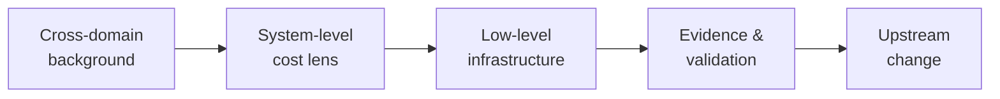
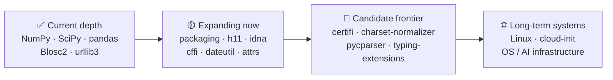
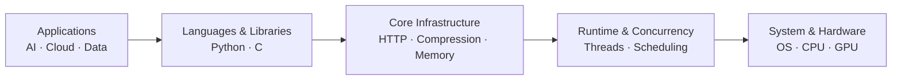
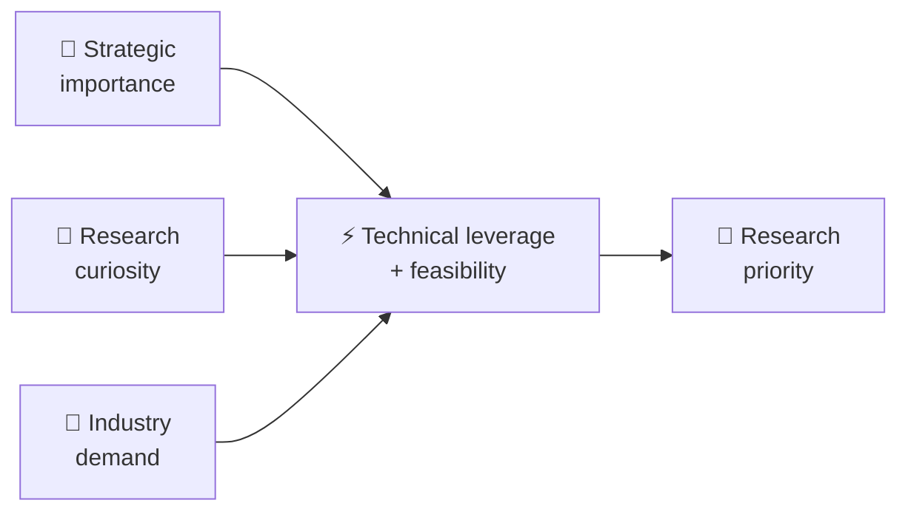
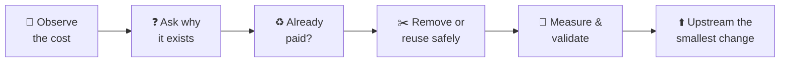

<h1 align="center">⚙️ CoreFoundry Project</h1>

  <strong>Improve the foundations before increasing the resources.</strong>

**Status:** Active · **Focus:** Upstream infrastructure · **Approach:** Zero incremental resource · **Funding:** Open

> **The next phase of AI will demand far more compute, memory, networking, and software infrastructure.**

Modern infrastructure was not built for an unlimited increase in agents, models, services, data movement, and online execution.

As AI-scale workloads grow, small inefficiencies compound:

- 🔁 repeated computation;
- 🧠 unnecessary memory work;
- 🔒 avoidable synchronization;
- 🧵 parallel startup costs that cannot be amortized;
- 🌐 networking and protocol overhead;
- 🧱 historical architectural assumptions that no longer scale well.

My view is simple:

> **Before adding more hardware, remove the work that never needed to happen.**

---

## 🧭 What I do

I independently work on lower-level open-source infrastructure where a relatively small upstream change can benefit many downstream workloads.

My background spans consulting, finance, exchanges, blockchain, data, and software systems. I use that cross-domain perspective to look beyond isolated code paths and ask what a system is **really paying for**.

I do not only ask **“Can this code run faster?”**

I also ask:

- Why does this work exist at all?
- Who ultimately pays for it?
- Has the same cost already been paid somewhere else?
- Does a local optimization create a larger system-level cost?
- What happens when this inefficiency is multiplied across millions of workloads?

---

## ❤️ Support CoreFoundry

[Sponsor CoreFoundry](https://github.com/sponsors/Johnny-Kao) · [Share infrastructure priorities](https://github.com/Johnny-Kao/CoreFoundry-Project/issues/new?title=Infrastructure%20priority%20signal)

If you share this view, there are two useful ways to help:

- **Sponsor the work** — funding increases the time, compute, CI, tooling, and validation capacity available for independent upstream engineering.
- **Send a priority signal** — tell me the three infrastructure bottlenecks, libraries, or recurring costs your organization thinks deserve more optimization attention.

> Sponsorship supports the broader program. It does not buy roadmap control, priority support, or guaranteed work on a specific request.

---

## 🚀 Selected high-impact upstream work

| Project / PR | What it is | What changed | Measured impact | Why this matters |
|---|---|---|---:|---|
| **[urllib3 #5304](https://github.com/urllib3/urllib3/pull/5304)** | Core HTTP gzip decompression | Eliminated unnecessary output copying on single-output paths | **~19–23% lower client CPU time** for tested 32 MiB gzip HTTP responses (8 paired A/B rounds) | Small, API-preserving changes can reduce CPU cost in foundational HTTP handling; controlled workloads, not a production-wide average |
| **[urllib3 #5287](https://github.com/urllib3/urllib3/pull/5287)** | Core HTTP infrastructure used throughout Python | Optimized the common single-value header path | **~9–13%** faster in representative request-construction workloads | Foundational HTTP improvements can propagate across a large number of Python applications |
| **[Memray #1035](https://github.com/bloomberg/memray/pull/1035)** | Python memory profiling and allocation-analysis infrastructure | Reduced high-contention synchronization overhead on Linux/glibc | **Up to 28%** runtime reduction at 256 threads | Profiling should observe workloads without becoming a major bottleneck itself |
| **[c-blosc2 #805](https://github.com/Blosc/c-blosc2/pull/805)** | High-performance compression infrastructure | Avoided unnecessary parallel startup and worker wakeups for small jobs | **35.86 μs → 2.02 μs** on a targeted 64-byte workload | Small workloads should not pay parallel execution costs they cannot amortize |
| **[python-blosc2 #728](https://github.com/Blosc/python-blosc2/pull/728)** | Python interface to high-performance compressed-data infrastructure | Removed redundant full-block zeroing in a NumPy miniexpr gather path | **~2–15%** improvement in tested workloads | Avoiding unnecessary memory work improves throughput without adding compute |

## 🧩 Other selected upstream work

| Project / PR | What it is | What changed | Measured / practical impact | Why this matters |
|---|---|---|---:|---|
| **[NumPy #32802](https://github.com/numpy/numpy/pull/32802)** | Foundational numerical-computing library | Fixed undefined shift behavior | **Correctness fix** | Low-level correctness bugs can affect a very large downstream dependency graph |
| **[SciPy #26225](https://github.com/scipy/scipy/pull/26225)** | Scientific-computing algorithms and numerical methods | Improved bracketing-solver iteration statistics | **More accurate solver accounting** | Better internal accounting improves reliability and makes behavior easier to reason about |
| **[python-blosc2 #713](https://github.com/Blosc/python-blosc2/pull/713)** | Compressed-array and data infrastructure | Improved free-threaded Python correctness | **Concurrency readiness** | Infrastructure must remain correct as Python moves toward broader free-threaded execution |

<!-- AUTOGENERATED_CONTRIBUTIONS_START -->
### Live Upstream Activity

**Open PRs:** 19 | **Merged PRs:** 9

Last data change: 2026-10-09 09:26 UTC

#### Recently Active PRs

- [opencv/opencv #30177: videoio: add zero-copy BGRA retrieval for AVFoundation 🤖🤖🤖](https://github.com/opencv/opencv/pull/30177)
- [bloomberg/bde #319: perf(ball): avoid repeated default-logger lookups](https://github.com/bloomberg/bde/pull/319)
- [scientific-python/blog.scientific-python.org #277: BLOG: Finding Another Layer of Performance in np.searchsorted](https://github.com/scientific-python/blog.scientific-python.org/pull/277)
- [numpy/numpy #32895: PERF: exploit insertion locality in batched searchsorted](https://github.com/numpy/numpy/pull/32895)
- [bloomberg/memray #1040: Write allocation records with one sink call](https://github.com/bloomberg/memray/pull/1040)

[Full Contribution Ledger](CONTRIBUTIONS.md)
<!-- AUTOGENERATED_CONTRIBUTIONS_END -->

**[View the live contribution ledger →](CONTRIBUTIONS.md)**

---

## 🗺️ CoreFoundry project map

CoreFoundry is not a collection of unrelated PRs. The work follows a deliberate path from scientific/data infrastructure toward more general Python infrastructure, protocol/native boundaries, and eventually system-level infrastructure.

### Project groups

| Group | Projects | Role |
|---|---|---|
| **Scientific & data infrastructure** | NumPy, SciPy, pandas, python-blosc2, c-blosc2 | Numerical computing, arrays, compression, data movement |
| **General Python infrastructure** | urllib3, packaging, python-dateutil, attrs | Widely reused runtime and packaging foundations |
| **Protocol / trust / native boundaries** | h11, idna, certifi, cffi | HTTP, naming, TLS trust, Python↔C boundary |
| **Candidate infrastructure frontier** | charset-normalizer, pycparser, typing-extensions, six | Broader foundational dependency surface |
| **Long-term systems direction** | Linux distribution, cloud-init, OS/runtime infrastructure | Deeper system layers and AI-era infrastructure |

> Status matters: projects in the final two rows are **directional targets or candidates**, not claims of existing contribution.

---

## 🧱 Where the work sits

The common thread is leverage: work lower in the stack can propagate upward into many downstream workloads.

That is why CoreFoundry deliberately prioritizes foundational infrastructure instead of isolated application-level optimization.

---

## 🏢 Organization-linked open-source work

Some projects are maintained by companies or foundations. These are grouped separately so infrastructure teams can quickly find work relevant to their ecosystem.

### Bloomberg-maintained open source

| Project / PR | What it is | What changed | Impact |
|---|---|---|---:|
| **[Memray #1035](https://github.com/bloomberg/memray/pull/1035)** | Python memory profiling infrastructure | Reduced contention overhead | **Up to 28%** at 256 threads |

> Listing an organization or project here refers only to public open-source work. It does not imply sponsorship, endorsement, or representation of CoreFoundry.

---

## 🎯 How I choose what to work on

I prioritize opportunities where several factors overlap:

- broad infrastructure reach;
- a measurable recurring cost;
- strong technical leverage;
- realistic upstream acceptance;
- clear correctness boundaries;
- real-world demand or a compelling research question.

---

## 🧠 Research philosophy

> **Before optimizing a cost, ask why the system is paying it at all.**

The principle is **zero-incremental-resource optimization**:

> Extract more useful work from the resources already being used before asking for additional ones.

In practice, that means reducing unnecessary CPU, memory, synchronization, data movement, initialization, or control-path work while preserving correctness and maintainability.

---

## 🤝 Participate

| If you want to… | The useful action |
|---|---|
| Increase independent upstream capacity | **[Sponsor CoreFoundry](https://github.com/sponsors/Johnny-Kao)** |
| Influence where I look next | **[Share your top three infrastructure priorities](https://github.com/Johnny-Kao/CoreFoundry-Project/issues/new?title=Infrastructure%20priority%20signal)** |
| Help validate an idea | Point me toward public benchmarks, reproducible workloads, or important open problems |

**Status:** Active · **Focus:** Upstream infrastructure · **Approach:** Zero incremental resource · **Funding:** Open

## Related research

**[AlpenCat](https://github.com/Johnny-Kao/AlpenCat)** is one concrete systems-research project exploring ultra-low-overhead execution routing under constrained compute.

---

**Johnny Kao**  
[GitHub](https://github.com/Johnny-Kao) · [GitHub Sponsors](https://github.com/sponsors/Johnny-Kao)
