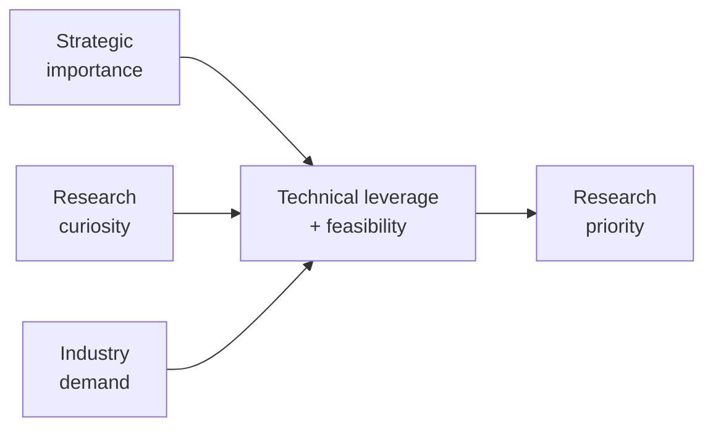
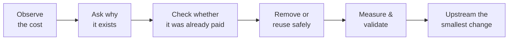

# CoreFoundry Project

> **The next phase of AI will demand far more compute, memory, networking, and software infrastructure.  
> Before we answer that demand with more resources, I believe we should first remove the work our systems never needed to do.**

Modern infrastructure was not designed for an unlimited increase in software agents, models, services, data movement, and online execution.

As AI systems scale, many small costs that once looked acceptable can be multiplied across enormous numbers of workloads: unnecessary initialization, repeated computation, avoidable synchronization, redundant memory movement, expensive control paths, and work that has already been paid for somewhere else.

If those costs remain embedded in foundational infrastructure, we may eventually constrain the next generation of computing with the architecture we inherited from the last one.

My long-term goal is simple:

> **Improve the foundations before increasing the resources.**

I focus on lower-level open-source infrastructure because improvements there can propagate broadly — through applications, data centers, networks, Python workloads, C libraries, runtimes, and operating systems.

## What I do

I independently research and contribute to widely used open-source infrastructure, with a focus on performance, correctness, concurrency, and **zero-incremental-resource optimization**.

I am not a mathematician, and I am not a full-time systems engineer. My background spans consulting, finance, exchanges, blockchain, data, and software systems.

That gives me a different way of looking at infrastructure problems.

I do not only ask:

> **Can this code run faster?**

I also ask:

- Why does this work exist at all?
- Who ultimately pays for it?
- Has the same cost already been paid somewhere else?
- What happens when this inefficiency is multiplied across millions of workloads?
- Is a local optimization creating a larger system-level cost?

I believe mature infrastructure engineering is not only about writing faster code. It is about understanding the **full cost of a system**.

---

## ❤️ Support the work

If you share this view, you can support the research and upstream work directly:

  

Funding increases the amount of independent upstream engineering capacity I can sustain:

- more time for research and implementation;
- benchmarking, CI, compute, and multi-platform validation;
- AI-assisted engineering and research tooling;
- reproducing difficult performance and concurrency behavior;
- turning validated findings into upstream-quality patches.

> Sponsorship supports the broader research program. It does not buy roadmap control, priority support, or guaranteed work on a specific request.

If funding is not a fit, there is another useful way to help:

> **Tell me the three infrastructure bottlenecks, libraries, or recurring costs your organization believes deserve much more optimization attention over the next few years.**

Real demand signals help me decide where independent upstream research is most likely to matter.

---

## 🚀 Selected high-impact upstream work

| Project / PR | What it is | What changed | Measured impact | Why this matters |
|---|---|---|---:|---|
| **[urllib3 #5287](https://github.com/urllib3/urllib3/pull/5287)** | Core HTTP infrastructure used throughout the Python ecosystem | Optimized the common single-value header path | **~9–13%** faster in representative request-construction workloads | Small improvements in foundational HTTP code can propagate across a large number of Python applications |
| **[Memray #1035](https://github.com/bloomberg/memray/pull/1035)** | Python memory profiling and allocation-analysis infrastructure | Reduced high-contention synchronization overhead on Linux/glibc | **Up to 28%** runtime reduction at 256 threads | Profiling infrastructure should observe workloads without becoming a major source of contention itself |
| **[c-blosc2 #805](https://github.com/Blosc/c-blosc2/pull/805)** | High-performance compression infrastructure | Avoided unnecessary parallel startup and worker wakeups for small jobs | **35.86 μs → 2.02 μs** on a targeted 64-byte workload | Small workloads should not pay parallel execution costs they cannot amortize |
| **[python-blosc2 #728](https://github.com/Blosc/python-blosc2/pull/728)** | Python interface to high-performance compressed data infrastructure | Removed redundant full-block zeroing in a NumPy miniexpr gather path | **~2–15%** improvement in tested workloads | Avoiding unnecessary memory work can improve throughput without adding compute |

## Other selected upstream work

| Project / PR | What it is | What changed | Measured / practical impact | Why this matters |
|---|---|---|---:|---|
| **[NumPy #32802](https://github.com/numpy/numpy/pull/32802)** | Foundational numerical computing library for the Python ecosystem | Fixed undefined shift behavior | **Correctness fix** | Low-level correctness bugs can affect a very large downstream dependency graph |
| **[SciPy #26225](https://github.com/scipy/scipy/pull/26225)** | Scientific computing algorithms and numerical methods | Improved bracketing-solver iteration statistics | **More accurate solver accounting** | Better internal accounting improves reliability and makes behavior easier to reason about |
| **[python-blosc2 #713](https://github.com/Blosc/python-blosc2/pull/713)** | Compressed array and data infrastructure | Improved free-threaded Python correctness | **Concurrency readiness** | Infrastructure needs to remain correct as Python moves toward broader free-threaded execution |

**[View the full contribution ledger →](MERGED_IMPACT.md)**

---

## 🧭 Where I work in the stack

The projects may look unrelated at first glance. They are not.

The common thread is that they sit in foundational layers where relatively small changes can affect many downstream workloads.

Current areas of interest include:

- scientific and data infrastructure;
- networking and HTTP hot paths;
- memory and profiling;
- compression and data movement;
- concurrency and free-threaded Python;
- runtime scheduling and heterogeneous compute.

---

## Work connected to specific infrastructure organizations

Some open-source projects are maintained by companies or foundations. I track those relationships because they help infrastructure teams quickly see work relevant to their ecosystem.

### Bloomberg-maintained open source

| Project / PR | What it is | What changed | Impact |
|---|---|---|---:|
| **[Memray #1035](https://github.com/bloomberg/memray/pull/1035)** | Python memory profiling infrastructure | Reduced contention overhead | **Up to 28%** at 256 threads |

> Listing a company or project here does not imply sponsorship, endorsement, or representation of this research program. It refers only to public open-source work.

Additional organization-specific groupings can be added as the contribution record grows.

---

## 🎯 How I prioritize research

I do not treat every optimization opportunity equally.

Research priority comes from the intersection of **strategic importance, research curiosity, real-world demand, technical leverage, and upstream feasibility**.

### Strategic priorities

I am especially interested in:

- foundational infrastructure used broadly and repeatedly;
- unnecessary work on common hot paths;
- costs that have already been paid and can be reused safely;
- synchronization, initialization, or data-movement overhead;
- free-threaded and highly concurrent execution;
- infrastructure pressure created by AI-scale workloads.

### Curiosity-driven research

Some investigations start with a simpler question:

> **Why is the system paying for this at all?**

Unexpected scaling behavior, duplicated work, strange initialization costs, and inherited architectural assumptions can all be useful starting points.

### Industry priorities

Signals from real infrastructure users matter because they reveal where recurring costs are already being paid at scale.

Companies do not control the roadmap, but they can help identify which problems deserve more attention.

---

## 🧠 Research philosophy

> **Before optimizing a cost, ask why the system is paying it at all.**

The principle is simple:

**remove unnecessary work before adding more resources.**

That usually means:

- reducing CPU, memory, synchronization, or execution overhead;
- reusing work that has already been paid for when it is safe;
- preferring small, reviewable, measurable changes;
- starting in foundational layers where gains can propagate broadly.

This is not a claim that optimization is literally free.

It is a preference for extracting more useful work from existing resources before asking for additional ones.

---

## Participate

There are three useful ways to contribute to this research program:

| If you want to… | The useful action |
|---|---|
| Increase independent upstream capacity | **[Sponsor the work](https://github.com/sponsors/Johnny-Kao)** |
| Influence where I look next | Share your **top three infrastructure bottlenecks or libraries** |
| Help validate an idea | Point me toward public benchmarks, reproducible workloads, or important open problems |

  

## Related research

**[AlpenCat](https://github.com/Johnny-Kao/AlpenCat)** is one concrete research project exploring ultra-low-overhead execution routing under constrained compute.

---

**Johnny Kao**  
[GitHub](https://github.com/Johnny-Kao) · [GitHub Sponsors](https://github.com/sponsors/Johnny-Kao)
